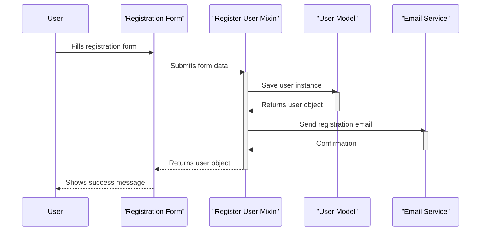
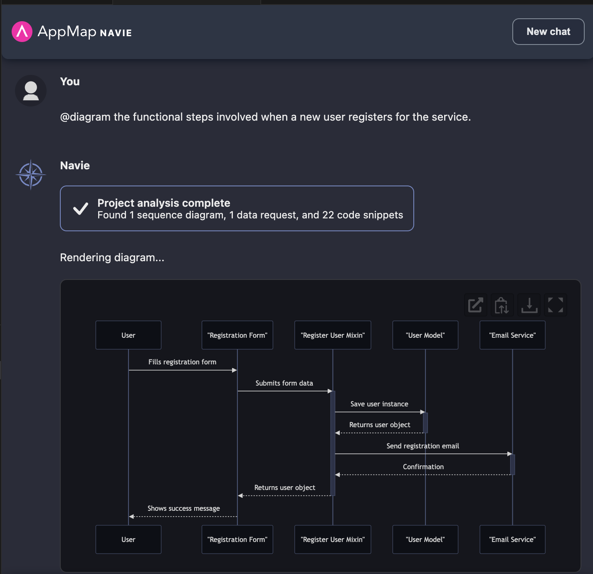
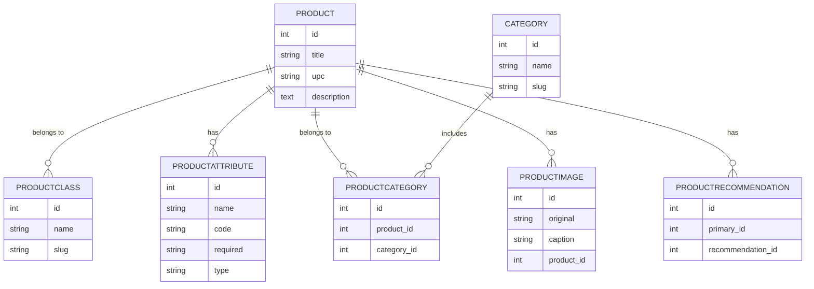
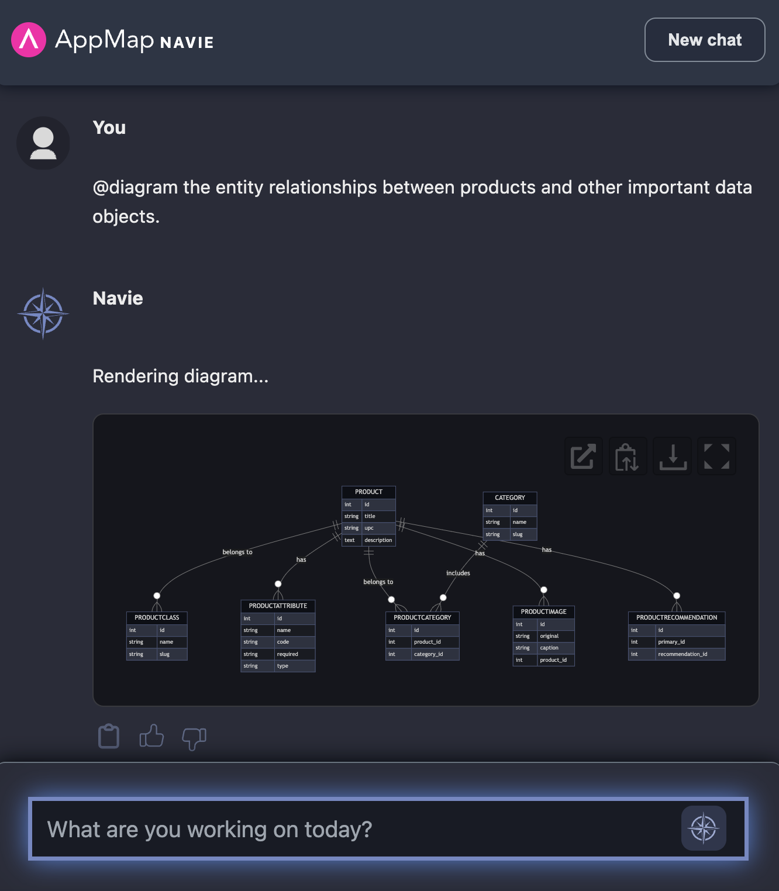
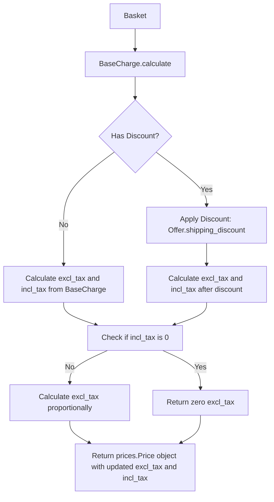
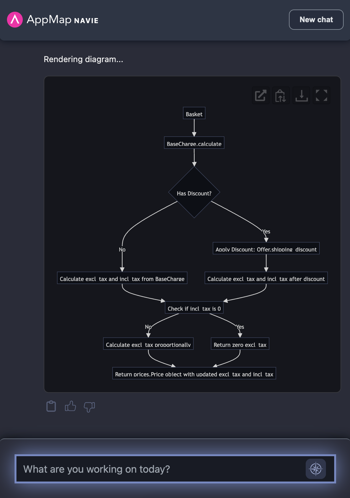
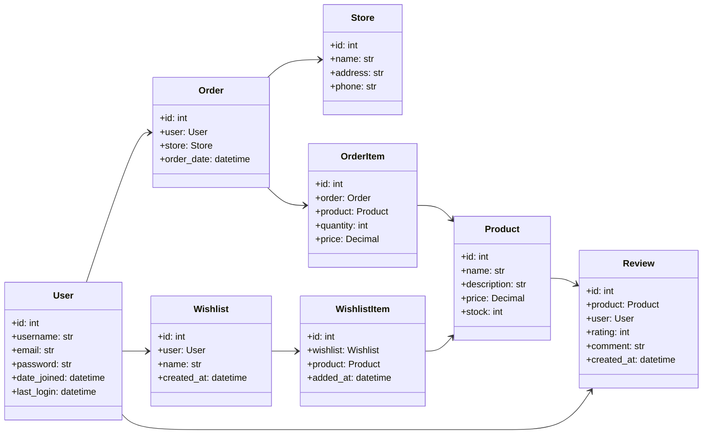
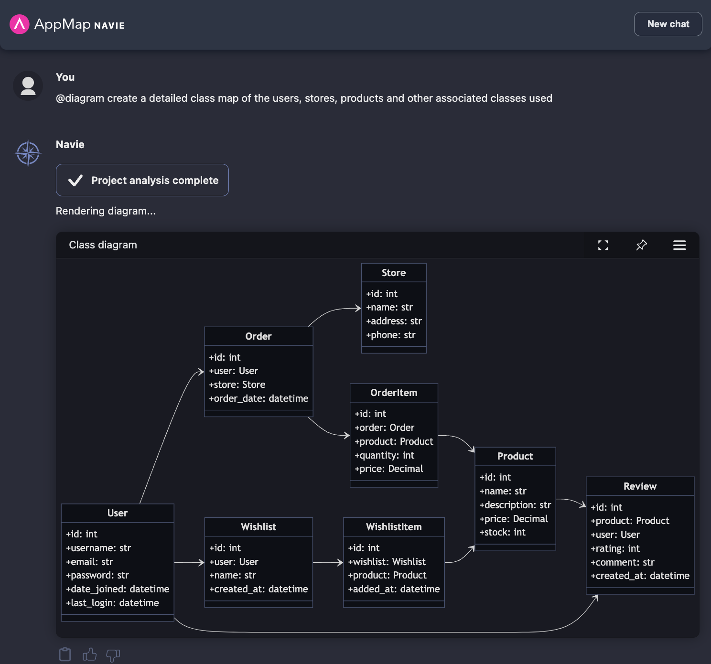

# How to use this repo

This project is a fork of the [Django Oscar](https://github.com/django-oscar/django-oscar) project. You can view the original [README here](OLD_README.rst). This an ideal Python Django project to use with the [AppMap Navie](https://appmap.io/navie/) AI Architect.

You can use this project to ask various questions of AppMap Navie using the `@diagram` command prefix.  
This will generate Mermaid diagrams that you can use within GitHub Issues & Pull Requests, or otherwise share 
with members of your team. 


## Example Diagrams
- [Sequence Diagram](#sequence-diagram)
- [Entity Relationship](#entity-relationship)
- [Flow Chart](#flow-chart)
- [Class Map](#class-map)


### Sequence Diagram
```
@diagram the functional steps involved when a new user registers for the service.
```






### Entity Relationship

```
@diagram the entity relationships between products and other important data objects.  
```






### Flow Chart

```
@diagram using a flow chart how product sales tax is calculated
```





### Class Map
```
@diagram create a detailed class map of the users, stores, products and other associated classes used
```



