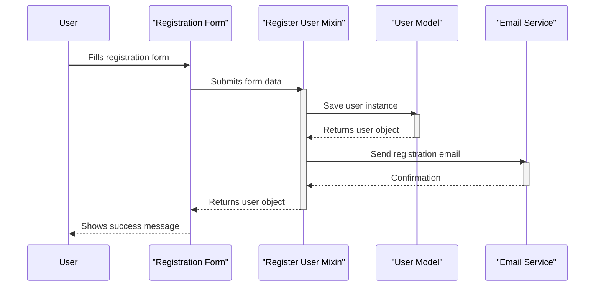
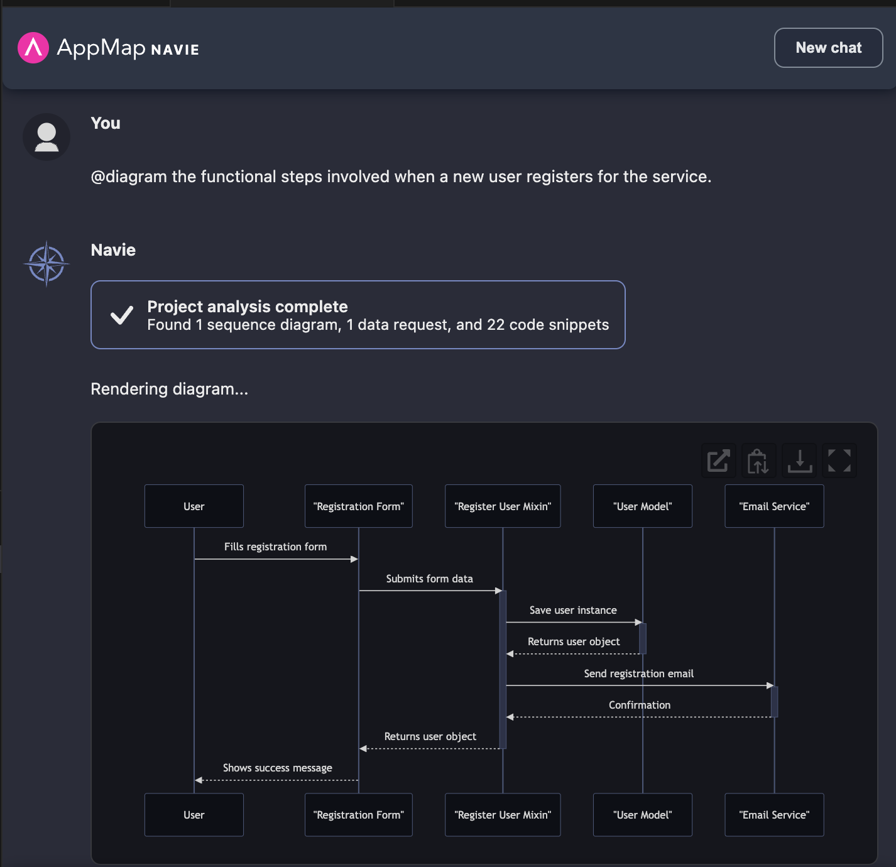

# How to use this repo

This project is an ideal Python Django project to use with the [AppMap Navie](https://appmap.io/navie/) AI Architect.

You can use this project to ask various questions of AppMap Navie using the `@diagram` command prefix.  
This will generate Mermaid diagrams that you can use within GitHub Issues & Pull Requests, or otherwise share 
with members of your team. 


## Example Diagrams

Example Question
```
@diagram the functional steps involved when a new user registers for the service.
```



